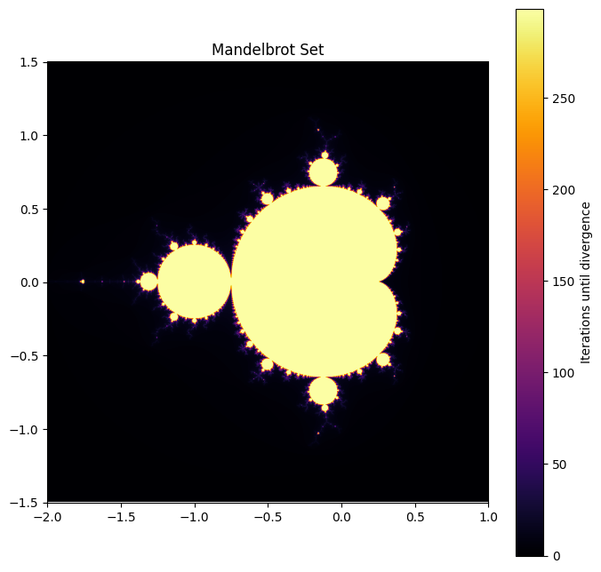

# Matplotlib

## Mandelbrot Set

教程看着有点无聊，就简单整了个 Mandelbrot 集的绘画

###  前置参数

~~~python
xmin, xmax, ymin, ymax = -2.0, 1.0, -1.5, 1.5
width, height = 2000, 2000
iter_times = 100
~~~

- `xmin`、`xmax`、`ymin`、`ymax` 自变量范围
- `width`、`height` 图像分辨率
- `iter_times` 迭代次数

### 生成复平面内的点

~~~python
x, y = np.linspace(xmin, xmax, width), np.linspace(ymin, ymax, height) 
X, Y = np.meshgrid(x, y)
C = X + 1j * Y
~~~

### 迭代生成结果

~~~python
Z = np.zeros(C.shape, dtype=complex)
iterations = np.zeros(C.shape, dtype=int)

for i in range(iter_times):
    mask = np.abs(Z) <= 2
    Z[mask] = Z[mask] ** 2 + C[mask]
    iterations[mask] = i  
~~~

- `Z` 初始化坐标网格
- `iterations` 记录迭代次数
- `mask` 掩码用于筛选未发散的点

### 绘图

~~~python
plt.figure(figsize=(8, 8))
plt.imshow(iterations, cmap='inferno', extent=(xmin, xmax, ymin, ymax))
plt.colorbar(label='Iterations until divergence')
plt.title('Mandelbrot Set')
plt.show()
~~~

## Reference

- [Quick start guide — Matplotlib 3.9.2 documentation](https://matplotlib.org/stable/users/explain/quick_start.html)
- [Matplotlib 教程 | 菜鸟教程 (runoob.com)](https://www.runoob.com/w3cnote/matplotlib-tutorial.html)